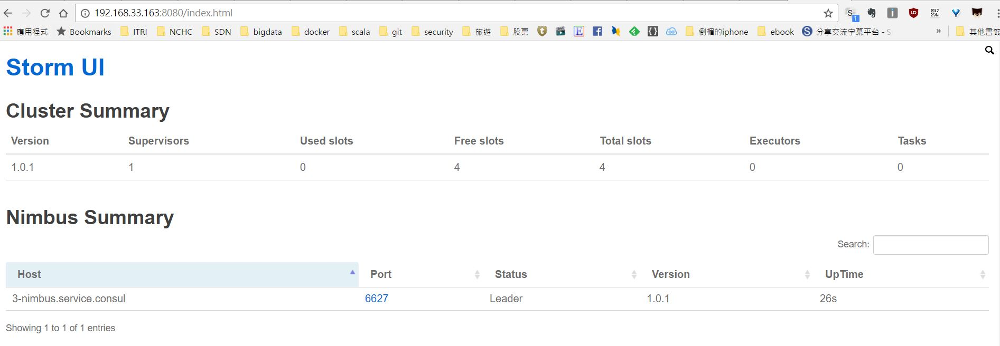
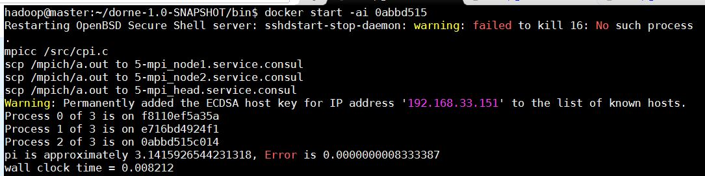

# Dorne

A Docker on YARN Implementation.

* **Known issue**: container inter-node communication is made by bridge network, all container is exposed in the same network.

# Steps for using Dorne in virtual environment
### 1. Setup Virtual Machines by Vagrant

* Modify VMs IP in Vagrantfile 

    ```ruby
    servers = [
        { 
            ...
            :ip => '192.168.33.70',
            ...
        },
        {
            ...
            :ip => '192.168.33.71',
            ...
        },
        {
            ...
            :ip => '192.168.33.72',
            ...
        }   
    ]
    ```
    
* Modify ip in hosts
    ```bash
    $ vim vagrant/resources/hadoop/hosts
    ...
    192.168.33.70 master
    192.168.33.21 slave1
    192.168.33.22 slave2
    ...
    ```

* Start VMs
    ```bash
    $ cd vagrant
    $ vagrant up 
    ```


### 2. Configure Hadoop Ecosystem 
* Login master node

    ```bash
    $ cd vagrant
    $ vagrant ssh master 
    ```
    
* Passwordless SSH loging

    ```bash
    master$  ssh-keygen -t rsa
    master$  ssh-copy-id hadoop@master
    master$  ssh-copy-id hadoop@slave1
    master$  ssh-copy-id hadoop@slave2
    ```
    
* Format HDFS
    ```bash
    master$ hadoop namenode -format 
    ```
    
* Start  HDFS and YARN
    ```bash
    master$ start-dfs.sh
    master$ start-yarn.sh
    ```

### 3. Configure Docker
* Make hadoop user can use docker in **EVERY** node
    ```bash
    master$ sudo groupadd docker
    master$ sudo gpasswd -a hadoop docker
    master$ sudo service docker restart
    ```
* Using following information to create a customized docker bridge in **EVERY** node

    | hostname   | master  | slave1  | slave2  |
    |---|---|---|---|
    | IP  | 192.168.33.70  | 192.168.33.71  | 192.168.33.72  |  
    | container IP range  | 192.168.33.{129~160}| 192.168.33.{161~192}  | 192.168.33.{193~224}  |   
    | docker CIDR  | 192.168.33.128/27  | 192.168.33.160/27  |  192.168.33.192/27 |   
    | Run consul ?  | Y | N |  N | 
    | Run registrator ? | Y  | Y |  Y | 
    
    Create customized bridge br0
    > ```bash
    > master$ sudo apt-get install bridge-utils iputils-arping
    > master$ sudo brctl addbr br0 ; sudo ip link set br0 up ; sudo ip addr add 192.168.33.70/24 dev br0 ; sudo ip addr del 192.168.33.70/24 dev eth1 ; sudo brctl addif br0 eth1
    >
    > master$ sudo vim  /etc/network/interfaces
    >
    >auto br0
    >iface br0 inet static
    >        address 192.168.33.70/255.255.255.0
    >        bridge_ports eth1
    >        bridge_stp off
    >```
    
    Change Docker default bridge, CIDR, and enable remote API
    >```bash
    >master$ sudo vim /etc/default/docker
    >DOCKER_OPTS="-b=br0 --fixed-cidr=192.168.33.128/27 -H tcp://0.0.0.0:2375 -H unix:///var/run/docker.sock"
    >
    ># restart docker service
    >master$ sudo service docker restart
    >```
    
    Create a container and verify the assigned IP address
    >```bash
    >master$ docker run -ti --rm ubuntu bash
    >master$ docker inspect <container id>
    >```


### 4. Build Consul and Registrator docker images

* Run Consul on **master**
    ```bash
    master$ export PRIVATE_IP=192.168.33.70

    master$ sudo docker run --rm --name consul -h $HOSTNAME \
        -p $PRIVATE_IP:8300:8300 -p $PRIVATE_IP:8301:8301 \
        -p $PRIVATE_IP:8301:8301/udp -p $PRIVATE_IP:8302:8302 \
        -p $PRIVATE_IP:8302:8302/udp -p $PRIVATE_IP:8400:8400 \
        -p $PRIVATE_IP:8500:8500 -p $PRIVATE_IP:53:53/udp \
        progrium/consul -server -advertise $PRIVATE_IP -bootstrap
    ```
* Run Registrator on **EVERY** node
    ```bash
    master$ git clone https://github.com/ogre0403/registrator.git
    master$ cd registrator
    master$ git checkout NCHC_release
    master$ sudo docker build -t myregistrator .   

    master$ export CONSUL_IP=192.168.33.70
    master$ sudo docker run --rm --name registrator \
        -v /var/run/docker.sock:/tmp/docker.sock  \
        -h $HOSTNAME  myregistrator \
        -internal -no-published-port=true consul://$CONSUL_IP:8500 
    ```
    > Knows issue: 
        a. -no-published-port為自行增的flag，設為true可以不設定export port, 預設值為false
        b. 若registrator若publish多個port，透過SERVICE_NAME會無法在dns上註冊
        https://github.com/gliderlabs/registrator/issues/425
        https://github.com/gliderlabs/registrator/issues/437

* Verify inter-container communication across hosts

    Create two container in different hosts
    ```bash
    slave1$ export DNS_IP=192.168.33.70
    slave1$ sudo docker run -ti --name xyz -h XYZ --dns $DNS_IP -e "SERVICE_NAME=xyz" --rm -p joffotron/docker-net-tools
    
    slave2$ export DNS_IP=192.168.33.70
    slave2$ sudo docker run -ti --name ijk -h ijk --dns $DNS_IP -e "SERVICE_NAME=ijk" --rm -p joffotron/docker-net-tools
    ```

    Check  DNS record in consul embed DNS server
    ```bash
    $ dig @192.168.33.70 xyz.service.consul
    ...
    ;; ANSWER SECTION:
    xyz.service.consul.     0       IN      A       172.17.0.90
    
    $ dig @192.168.33.70 ijk.service.consul
    ...
    ;; ANSWER SECTION:
    ijk.service.consul.     0       IN      A       172.17.0.88
    ```

    Container ping with each other
    ```bash
    root@ijk:/# ping xyz.service.consul
    ...
    PING xyz.service.consul (172.17.0.90) 56(84) bytes of data.
    64 bytes from 172.17.0.90: icmp_seq=1 ttl=64 time=0.135 ms
    
    root@xyz:/# ping ijk.service.consul
    ...
    PING ijk.service.consul (172.17.0.88) 56(84) bytes of data.
    64 bytes from 172.17.0.88: icmp_seq=1 ttl=64 time=0.105 ms
    ```

### 5. Pre-Build Dorne sample application docker images

* Sample 1: Storm cluster
    Build zookeeper docker images on **EVERY** nodes
    ```bash
    $ git clone https://github.com/ogre0403/docker-zookeeper.git
    $ cd docker-zookeeper
    $ git checkout NCHC_service
    $ docker build -t ogre/zookeeper:3.4.8 .
    ```

    Build storm docker images on **EVERY** nodes
    ```bash
    $ git clone https://github.com/ogre0403/storm-docker.git
    $ cd storm-docker
    $ git checkout NCHC_service
    $ cd 1.0.1
    $ docker build -t ogre/storm-docker:1.0.1 .
    ```

* Sample 2: MPI cluster
    Build MPICH docker images on **EVERY** nodes
    ```bash
    $ git clone https://github.com/ogre0403/mpich-docker.git
    $ cd mpich-docker
    $ git checkout NCHC_service
    $ cd ogre
    $ docker build -t ogre/mpich .
    ```

### 6. Build and deploy from source 
   * Download source code and build. 
    ```bash
    $ git clone https://github.com/ogre0403/Dorne.git
    $ cd Dorne
    $ git checkout review 
    $ cd YarnApp
    $ mvn clean dependency:copy-dependencies package
    $ cp target/dorne-1.0-SNAPSHOT-all.tar.gz ~
    ```
   * Copy dependency jars into /home/hadoop/dorne_api ($DORNE_HOME/lib) on each host    
    ```bash
    $ cd ~
    $ tar zxvf dorne-1.0-SNAPSHOT-all.tar.gz
    $ cp -r dorne-1.0-SNAPSHOT/lib/dependency/ ~/dorne_api
    $ scp -r ~/dorne_api hadoop@slave1:/home/hadoop
    $ scp -r ~/dorne_api hadoop@slave1:/home/hadoop
    ```


### 7. Run dorne samples
* Sample 1: Storm cluster
    Edit yaml file, change all dns IP
    ```bash
    $ vim example/storm.yml
     ...
        dns:
          - 192.168.33.70
     ...
    ```
    Start Storm cluster
    ```
    $ ./start-dorne-service.sh ../example/storm.yml
    
    ... 
    [INFO ] 09:31:50 Client.java:388 wait for connect to RM...
    [INFO ] 09:31:55 Client.java:383 AM: slave1/192.168.33.71
    [INFO ] 09:31:55 Client.java:384 AM rpc port: 51249
    [INFO ] 09:31:55 Client.java:412 Wait for 0/4 Cluster Mode Container up...
    ... 
    ```
    Show individual service
    ```bash
     $ ./show-dorne-services.sh slave1 51249
    [INFO ] 09:43:10 ThriftClient.java:110 nimbus/determined_colden@slave2:192.168.33.196
    [INFO ] 09:43:10 ThriftClient.java:110 zookeeper/ecstatic_kirch@slave1:192.168.33.165
    [INFO ] 09:43:10 ThriftClient.java:110 ui/tender_carson@slave1:192.168.33.163
    [INFO ] 09:43:10 ThriftClient.java:110 supervisor/lonely_jones@slave2:192.168.33.197
    ```
    Open Strom web UI at port 8080 
    
    
    Shutdown Storm cluster
    ```bash
    $ ./shutdown-dorne-service.sh slave1 51249
    [INFO ] 09:33:01 ThriftClient.java:124 Stop nimbus...
    [INFO ] 09:33:12 ThriftClient.java:124 Stop zookeeper...
    [INFO ] 09:33:13 ThriftClient.java:124 Stop ui...
    [INFO ] 09:33:23 ThriftClient.java:124 Stop supervisor...
    ```

* Sample 2: MPI cluster
    Edit yaml file, change all dns IP
    ```bash
    $ vim example/mpi.yml
     ...
        dns:
          - 192.168.33.70
     ...
     ```
     Mount the mpi program source code folder to /src inside container 
     ```bash
        volumes:
           - /home/hadoop/docker-service/mpich-docker/ogre/src:/src
    ```
    Start MPI cluster
    ```bash
    ./start-dorne-service.sh ../example/mpi.yml
     ... 
     [INFO ] 03:42:28 Client.java:388 wait for connect to RM...
     [INFO ] 03:42:33 Client.java:383 AM: slave2/192.168.33.72
     [INFO ] 03:42:33 Client.java:384 AM rpc port: 49726
     [INFO ] 03:42:33 Client.java:412 Wait for 0/2 Cluster Mode Container up...
        ...
     [INFO ] 03:42:55 Client.java:448 container id: 0abbd515
     [INFO ] 03:42:55 Client.java:449 Use "docker start -ai 0abbd515" to run
     [INFO ] 03:42:55 Client.java:100 Application completed successfully
    ```
    
    Use ```docker start``` cmd to run mpi program
    
    
    Show individual service
    ```bash
    $ ./show-dorne-services.sh slave2 49726
    [INFO ] 05:04:23 ThriftClient.java:110 mpi_node2/agitated_goldstine@slave2:192.168.33.205
    [INFO ] 05:04:23 ThriftClient.java:110 mpi_node1/cranky_hopper@slave1:192.168.33.173
    ```

    Shutdown MPI cluster
    ```bash
    $ ./shutdown-dorne-service.sh slave2 49726
    [INFO ] 05:07:00 ThriftClient.java:124 Stop mpi_node2...
    [INFO ] 05:07:11 ThriftClient.java:124 Stop mpi_node1...
    ```
   
### 8. TODO
  * Docker volume should have mountable distributed FS ?
  * Support clutser and clinet mode ?
  * Support build docker images by end users on the fly.
